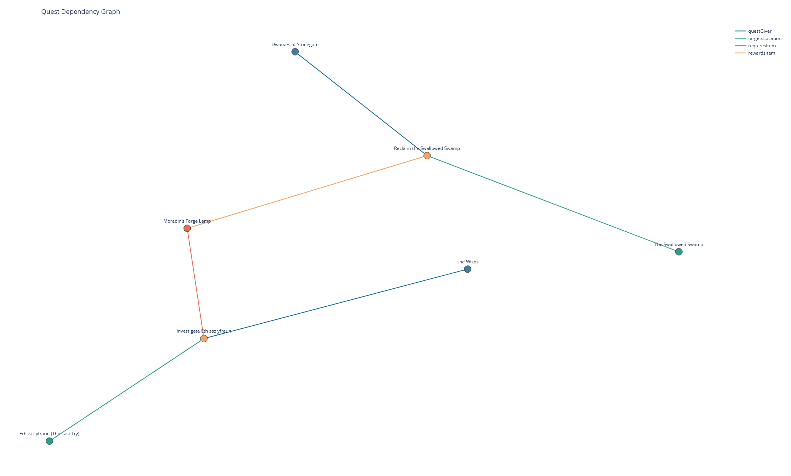

# A Semantic Web for Dungeons and Dragons



A fantasy world naturally lends itself to formalization through a **Semantic Web**. As the fantasy author world-builds, they construct a T-Box and an a A-Box without even trying. 

They build the T-Box as they settle rules and logic, deciding that 'hobbits canWear rings', and so on.
They build the A-Box when 'Frodo' becomes a hobbit and starts walking away from 'Bag End'. 

This project is one such **Semantic Web** formalization built for a Dungeons and Dragons setting, using the Python technologies OwlReady2 and RDFLib as a backbone. 

## Included: 
- DnD World Ontology         -- `ontology.py`
- Triplet Ingestion Pipeline -- `ingest.py`
- Triplet Inference          -- `reason.py`
- Natural Language Querying  -- `ask.py`
- Visualization Dashboard    -- `dashboard.html`

## Setup 
### Requirements
#### Python
Python 3.10+
- owlready2==0.50
- rdflib
- numpy
- pyyaml
- plotly
- networkx
- pytest
- Optional: anthropic

#### Java 
OWL reasoning with HermiT requires Java 8+.

Check your version:
`java -version`

If Java is not installed, download OpenJDK from:
https://adoptium.net

### Virtual Environment - pyproject.toml
Create and activate a virtual environment, then install from `pyproject.toml`:

```bash
python -m venv .venv
.venv\Scripts\activate
python -m pip install --upgrade pip
python -m pip install -e .
```

### Running
Run the full pipeline (ontology -> ingest -> reason -> query -> visualization) in one command:

```bash
python -m dndonto.pipeline --overwrite-ontology --pause-between-stages
```

If you install the package in editable mode, you can also use:

```bash
dndonto-pipeline --overwrite-ontology --pause-between-stages
```

What this gives you:
- Optional pause after each stage (`--pause-between-stages`) to inspect files in `out/`.
- Final query output against inferred triples so reasoning effects are visible immediately.
- Toy visualizations showing class relationships.

Useful options:
- `--skip-query` to stop after reasoning.
- `--format json` for machine-readable query output.
- `--allow-inconsistent` to continue even if HermiT reports an inconsistency.

### Visualization Endpoint (Plotly)
Open `dashboard.html` in a browser after running the pipeline to view all four visualizations in one place.

Optional: Manually generate interactive HTML visualizations from asserted and inferred Turtle outputs:

```bash
dndonto-viz --inferred-ttl out/dnd_world_inferred.ttl --asserted-ttl out/dnd_world_triples.ttl --out-dir out/viz
```

Generated files:
- `out/viz/location_tree.html` (Location containment tree from `partOf`)
- `out/viz/quest_graph.html` (Quest dependency graph)
- `out/viz/faction_graph.html` (Faction relationship network)
- `out/viz/reasoning_delta.html` (Asserted vs inferred delta)

### Ask Endpoint (Natural-Language Q&A)
Ask natural-language questions about your knowledge graph. 
Claude generates a SPARQL query, executes it against the inferred graph, and summarises the results.

Requires the optional `llm` dependency:

```bash
pip install -e ".[llm]"
```

You also need an Anthropic API key, either passed via flag or the `ANTHROPIC_API_KEY` environment variable.

```bash
dndonto-ask "Who are the allies of the Iron Hand?"
```

Options:
- `--ttl PATH` — Inferred Turtle graph to query against (default: `out/dnd_world_inferred.ttl`)
- `--anthropic-key KEY` — Anthropic API key (defaults to `ANTHROPIC_API_KEY` env var)
- `--model MODEL` — Anthropic model to use (default: `claude-sonnet-4-6`)

The three-step pipeline:
1. **Generate** — Claude reads the ontology schema and writes a SPARQL SELECT query.
2. **Execute** — The query runs against the inferred RDFLib graph.
3. **Interpret** — Claude summarises the raw results as a concise answer.

## Corpus
Handwritten homebrew DnD materials make up the corpus of knowledge for this web.
I used GPT5.4 to produce a YAML-formatted "Lore" document for ingestion into the ontology.
Limitations of this approach are discussed in data/lore.yaml.

## Ontology
The ontology is built under the OWL 2 DL profile of the OWL 2 formal standard.
It focuses on Locations, Characters, Factions, Items, and Quests. 
While all classes have properties between them, Quests stand out as the main material link. 
I built the ontology to demonstrate the use of several ObjectProperties, class hierarchies, and formalization features of the OwlReady2 package.

## Knowledge Graph
Lore ingests in two passes, first to determine unique individuals and second to apply properties to those individuals. 
This creates the initial triplet store over which we infer, using the HermiT reasoner.
Finally, with the inferred triplet store built, one may query using RDFLib and SPARQL from the commandline.

### Ingestion Typing Rules
Each entity can declare a `type` in `data/lore.yaml`.
The ingest step uses that `type` to choose the ontology class for the individual (for example, a `Location` section entity may declare `type: City` or `type: Dungeon`).

Validation rules:
- If `type` is omitted, ingest defaults to the top-level section class.
- If `type` is present, it must be a valid ontology class.
- The declared `type` must be compatible with the section (a subclass of the section class).
- The `type` key is treated as schema metadata and is not ingested as an ontology property assertion.

This helps preserve class specificity in ABox assertions while retaining a simple top-level YAML organization.

### Reasoner Caveat
The choice of ontology profile influences choice of reasoner.
Other choices of reasoner exist, including Pellet or faCT++.
In this version of OwlReady2 (0.5) Pellet is implemented in Java25, while HermiT should run almost anywhere.
A faCT++ integration requires moving away from OwlReady2, towards a tool like Protégé, which is outside the scope of this project.